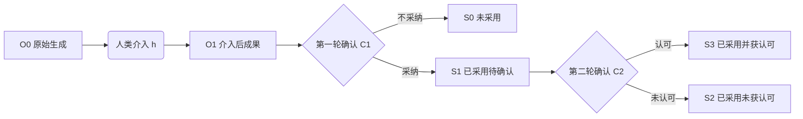
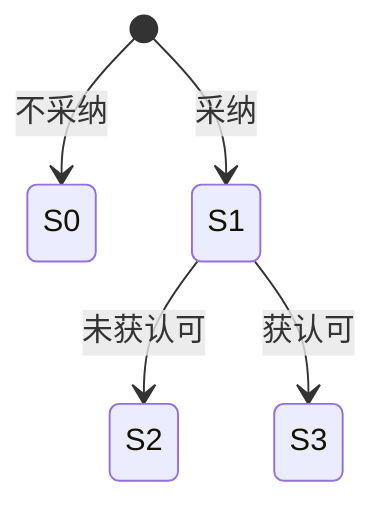

# 人类认知杠杆率：一种评估AI使用者稀疏介入能力的方法

## 从少量关键判断到可采纳的AIGC成果

> **文档声明**：本文是HCLR方法的定稿方法稿（v0.4），用于传播、引用与社区讨论，非正式学术期刊发表。文中的公式与参考值均为**实验性设计**：介入量I在自动记录场景下默认以Token数（或字符数）计算，测量的是显性介入表达杠杆，不包含形成判断所需的认知投入成本。读者不应将任何数值解读为已验证的测量结果。实证数据正在对话场景中持续积累（见[examples/PILOT_CASE_CN.md](examples/PILOT_CASE_CN.md)）。方法的最新、最简说明见本仓库[README](README_CN.md)。
>
> 版本：0.4（方法稿，第四版原始稿）
>
> 修订历史：v0.1（2026-08-12）初始方法稿；v0.2（2026-08-12）介入量Token默认口径、分析单位统一为任务事件、新增流程图与术语表、补充测量学文献；v0.3（2026-08-12）核心公式改为输出/介入杠杆率（O/I）；v0.4（2026-08-12）彻底删除改变范围P1–P5与辅助指标概念，双重确认保留为结果状态记录。
>
> 作者：Rootosophy

## 摘要

生成式AI能够快速产生长篇、稠密的内容，但使用者对成果的关键贡献未必表现为同等规模的修改。实践中，一条很短的介入，例如“这个数据只能说明相关，不能说明因果”“为什么默认竞争对手保持不动”或“这个战略没有考虑执行能力”，可能使AI重新组织大部分内容，并使原本不可用的初稿成为使用者愿意采纳、且适合交付给目标受众的成果。本文把这种能力称为AI使用者的稀疏介入能力，并提出人类认知杠杆率（Human Cognitive Leverage Ratio，HCLR）作为一种可采纳的评估方法。

HCLR评估的不是人的一般智力，也不判断AIGC成果是否达到抽象意义上的客观真理。它关注一个更具体的实践问题：在给定模型、任务领域和相对稳定的使用周期内，使用者以多少显性介入（Token计），使模型产生多少输出（Token计）。核心比率定义为**输出/介入杠杆率**：模型输出Token总和除以使用者介入Token总和。本文不再采用主观的改变范围评分（P1–P5）。双重确认（使用者确认采纳、根据受众反馈确认认可）保留为结果状态记录，不参与杠杆率计算。

本文给出HCLR的定义、计算方式、介入量记录方法以及个人层面的汇总方法，并提出一套轻量测量协议。使用者持续完成两轮确认后，可以形成个人HCLR变化曲线，观察自己能否以更少、更关键的判断产生更多可采纳成果。该数据还可为模型厂商补充现有即时好坏反馈：第一轮记录成果是否真正被采用，第二轮记录采用后是否得到受众认可；如果同时保存原始输出、稀疏介入和修改后成果，重复出现的高杠杆介入可以转化为模型评测项和训练材料。本文不把HCLR主张为AI使用能力的唯一指标，也不把它作为脱离模型和任务环境的永久能力分数。

需要特别说明：HCLR测量的是使用者的显性介入表达杠杆（自动记录场景下以Token计），不测量完整认知投入，也不是人的一般智力或总体认知水平量表。

**关键词：** 生成式AI；人类认知杠杆率；稀疏介入；AI使用者；成果采纳；受众认可；评估方法

---

## 1. 问题提出

生成式AI降低了内容生产成本。研究报告、商业分析、产品方案、代码说明和传播材料都可以在较短时间内形成初稿。内容变多之后，人的工作并没有简单消失，而是从直接生产大量文本，部分转向判断哪些内容能用、哪些假设不成立、哪些关键约束被遗漏，以及怎样调整才能使成果真正进入使用和交付。

这种变化造成了一个值得单独测量的不对称现象：

$$
10000\text{个生成内容单元}
\rightarrow
10\text{个关键判断}
\rightarrow
1\text{个关键质疑}
\rightarrow
50\%-100\%\text{的成果重构}
$$

这里的数字是现象示意，不是固定比例。它描述的是一种结构：AI进行稠密生成，人类进行稀疏介入，AI再根据少量介入完成大范围修改。人的显性输出很少，但这部分输出可能决定成果是否能够采用。

现有的人机协作研究常用完成时间、准确率、偏好、采纳率或人机组合绩效衡量协作结果。人和AI组合后并不必然优于单独一方，解释和控制界面也不保证产生互补绩效。[2][3]

认知强制机制的实验进一步说明，界面设计会影响人是否认真检查AI建议。[6]

算法厌恶研究表明，人们看到算法犯错后可能减少使用；允许使用者对算法结果进行一定修改，则可能提高其继续采用算法的意愿。[4][5]

这些研究说明“人是否能够介入”会影响使用行为，但没有直接回答另一个问题：不同使用者通过少量介入把AIGC初稿转化为可采纳成果的能力，能否被独立记录和比较。

本文提出人类认知杠杆率，目标不是建立一套关于人类认知或人机协作的完整理论，而是提出一种实际可用的评估方法。它回答三个问题：

1. 什么样的行为可以计为一次稀疏介入？
2. 如何判断介入是否产生了有效改变？
3. 如何通过持续记录HCLR，观察同一使用者的稀疏介入能力是否发生变化？

本文的基本主张是：在AIGC使用中，人的价值不能只通过文字产量、提示词长度或修改次数衡量。少量介入对最终成果的有效改变程度，是另一个值得观察的能力维度。

## 2. 方法定位与适用边界

### 2.1 HCLR评估什么

HCLR评估的是：

> 在给定大模型、任务领域和观察周期内，AI使用者以有限的显性介入（Token计），使模型产生的输出规模（Token计）发生可观察的杠杆效应。核心指标为输出/介入杠杆率；采纳确认与受众认可确认作为结果状态记录，不参与计算。

这一定义包含四个对象：

- **使用者**：阅读、判断和介入AIGC成果的人；
- **介入**：使用者向AI提供的纠正、质疑、约束、补充或框架调整；
- **成果改变**：介入前后AIGC成果在内容、结论、结构或方向上的实质差异；
- **实践有效性**：第一轮由使用者确认本人采纳；第二轮仍由使用者根据受众反馈确认成果获得认可。

HCLR首先是表现指标，不是稳定人格特质。一个人在战略分析任务中可能具有较高杠杆率，在法律写作或代码审查中则未必如此。因此，任何分数都必须附带模型、任务领域和观察周期。

### 2.2 HCLR不评估什么

HCLR不直接评估：

- 一个人的全部认知能力；
- AIGC成果是否具有不可质疑的客观正确性；
- 使用者的道德水平或诚信；
- 大模型本身的综合能力；
- 最终成果的长期社会价值；
- 员工的整体绩效；
- 所有AI使用能力的统一排名。

信息价值理论强调，信息的价值取决于它是否改变行动与结果，而不是符号数量。[1] HCLR与这种实践取向相近，但不要求为每项任务建立完整效用函数。对于多数知识工作，成果是否被使用者采用、是否适合其目标受众，是更直接也更容易记录的判断。

### 2.3 为什么不要求“客观正确”

“被采纳”和“被认可”不等于客观正确，这一判断本身成立，但它不构成否定HCLR的理由。HCLR要评价的是成果在具体任务中的可采纳性，而不是建立终极真理标准。

咨询建议、战略方案、产品定义、品牌表达和组织决策往往不存在唯一答案。它们需要事实与逻辑基础，但最终仍要接受情境、目标、资源、风险偏好和受众判断。若把“客观正确”设为所有任务的前提，评估会滑向无法结束的认识论争论，也会失去实际使用价值。

因此，HCLR采用操作性标准：

1. 成果生成后，使用者是否愿意对成果负责并实际采用；
2. 成果触达目标受众后，使用者是否根据真实反馈确认受众认可。

第一轮确认后即可形成采纳HCLR。第二轮确认存在时间滞后，尚未交付或尚未获得反馈的成果保持“待确认”，不计为未获认可。整个判断过程由使用者完成，不要求研究者或系统直接向受众采集数据。

### 2.4 大模型是既定工具环境

HCLR不要求从结果中彻底剥离模型能力。大模型在相对稳定的使用周期内可以被视为既定工具环境。使用者会判断模型的初稿质量、介入后的结果以及是否继续使用该模型。当使用者更换或放弃模型时，原模型条件下的分数仍可作为历史记录，但不再代表当前使用能力。

因此，HCLR应写成条件指标：

$$
HCLR(u\mid m,d,T)
$$

其中：

- $u$ 表示使用者；
- $m$ 表示模型及其版本；
- $d$ 表示任务领域；
- $T$ 表示相对稳定的观察周期。

在比较不同使用者时，最好采用相同或可比的模型环境。若模型不同，应分别报告，而不把分数直接当作脱离环境的个人能力排名。

### 2.5 它只是一种评估方法

HCLR可以与其他指标并列使用，例如任务完成时间、事实核查准确率、用户满意度、创造性、业务结果或专业评审分数。它不替代这些指标，也不主张成为唯一方法。

它补充的是一个具体盲区：当AI承担了大部分内容生成后，继续按文字数量和修改数量评价人，会低估少量关键判断的价值。HCLR尝试把这种价值显性化。

### 2.6 过程链

一次完整评估遵循以下过程链：AI稠密生成 → 人类稀疏介入 → AI重构成果 → 第一轮确认采纳 → 成果触达受众 → 第二轮确认认可。

符号含义见3.4–3.5节，状态定义见4.4节。

## 3. 核心概念

### 3.1 稠密生成

稠密生成是指AI在较低边际成本下产生大量相互关联的内容，包括事实陈述、分析、假设、建议、代码、图表说明或表达文本。这里的“稠密”不是严格的数学概念，而是相对于人的介入量而言：AI输出通常显著长于人类后续提供的关键判断。

### 3.2 稀疏介入

稀疏介入是指使用者对AIGC成果提供数量较少、但能够引起实质改变的显性输入。介入可以是一句话、一项约束、一个反例或一个新的问题框架。

典型介入包括：

1. 事实纠正：“该市场规模使用了不同的统计口径。”
2. 推理质疑：“该数据只能说明相关，不能说明因果。”
3. 假设挑战：“为什么默认竞争对手不会反应？”
4. 约束补充：“这个战略没有考虑现有组织的执行能力。”
5. 决策要求：“缺少P&L，不能得出扩张结论。”
6. 框架替换：“当前分析框架回答的不是发起者真正要解决的问题。”

“稀疏”应由介入量与模型输出规模的关系事后判断，而不是提前限制使用者只能提出几个问题。使用者可以完整阅读和自由介入；如果最终只有少量介入带来了大量有效输出，就形成了可观察的稀疏介入现象。

### 3.3 自主介入

本文只记录由使用者形成并表达的实质判断。AI可以帮助展示材料、整理内容或执行修改，但不能把自己生成的批判重新计为人的认知贡献。

这并不要求介入必须完全没有AI辅助。实践中，使用者可能通过多轮对话逐步形成判断。测量时需要区分：

- AI提出问题，使用者只作确认；
- 使用者在AI提示基础上加入新的判断；
- 使用者主动提出AI此前没有表达的质疑。

后两类都可以记录，但应标注介入来源。该标注用于解释分数，不必成为复杂的理论变量。

### 3.4 使用者采纳

使用者采纳表示，介入后的成果达到使用者愿意实际使用或交付的标准。采纳不能只用“看起来更好”代替，应尽量留下行为记录，例如：

- 将该版本作为正式报告；
- 将建议提交给决策者；
- 将内容用于演示、沟通或发布；
- 将代码、方案或需求纳入下一流程；
- 明确选择该版本而放弃原始版本。

采纳与否用第一轮确认 $C_{1j}$ 记录（见3.5节），不再单独定义采纳变量。

### 3.5 使用者双重确认

HCLR的有效性判断由使用者在两个时间点完成，不要求系统直接联系目标受众。

第一轮发生在成果生成和介入完成后。使用者确认本人是否愿意采用或交付该成果：

$$
C_{1j}=
\begin{cases}
1,& \text{使用者确认采纳}\\
0,& \text{使用者不采纳}
\end{cases}
$$

第二轮发生在成果触达目标受众并产生反馈后。仍由使用者根据自己观察到的反馈确认受众是否认可：

$$
C_{2j}\in\{1,0,\varnothing\}
$$

其中，1表示使用者确认受众认可，0表示使用者确认受众未认可，$\varnothing$表示尚未交付或尚未获得足够反馈。待确认不是失败，不能按0计入。

目标受众可能是客户、上级、合作团队、用户、评审者或公开传播对象。“认可”不要求受众赞同全部内容，而是成果达到进入下一步行动、沟通或决策的门槛。使用者能够理解受众的关注点，并让AIGC成果符合这一标准，本身就是AI应用能力的一部分。

为保持记录简便，第二轮只需确认状态及反馈依据类别，例如明确接受、进入下一阶段、核心认可但要求局部修改、核心成果被拒绝或仍待反馈。系统不必保存受众身份和完整原始反馈。

双重确认在HCLR中作为结果状态记录，不进入输出/介入杠杆率的计算；它记录成果是否被采纳、是否获受众认可。

### 3.6 介入量

介入量表示使用者为改变成果所提供的显性输入。本文建议分别记录，不急于合成复杂成本：

- 独立判断数量；
- 独立语义命题数量；
- 介入文字或Token数量；
- 介入次数；
- 审阅与表达时间。

**自动化默认口径**：在系统自动记录的场景下，介入量I默认以介入文本的Token数（或字符数）计算。选择Token作默认口径的理由：客观、可自动统计、可复现，使用者零标注负担。边界：Token数测量的是表达长度，不包含形成判断所需的审阅、搜索、核查与推理成本[9]，也不等于独立判断数量；因此Token口径的HCLR反映的是"显性介入表达杠杆"，而非完整的认知投入。不同模型的分词器不同，跨模型比较时需在记录中声明分词口径。

其中，独立语义命题数量最接近“信息量”。例如，“数据口径不一致，因此市场规模不能直接比较”包含事实判断和推论判断，可以记为两个相关命题。在需要语义口径的研究场景中，仍可采用判断数或语义命题数；两种口径应在记录中声明，不宜混用。

## 4. HCLR的计算

### 4.1 基本公式：输出/介入杠杆率

HCLR的核心指标衡量使用者通过单位介入使模型产生的输出规模。对第 \(j\) 个任务事件：

$$
\boxed{
HCLR_j=
\frac{O_j}{I_j}
}
$$

其中：

- \(O_j\)：任务事件内模型输出的Token总数（或字符数），包含该事件的全部生成轮次（O0、O1及中间输出）；
- \(I_j\)：任务事件内使用者介入的Token总数（或字符数），指针对模型输出的反馈、纠正、约束与方向调整，**不含初始任务描述**。

采用Token（或字符数）作为分子的理由：输出规模是模型响应用户介入的直接结果，可自动统计、可复现；分母同理，使用者零标注负担。边界：该指标测量"输出规模/介入规模"的杠杆关系，不测量输出质量、认知投入或社会认可。

### 4.2 分子与分母的操作化

- **分子 \(O_j\)**：任务事件内模型全部输出Token之和。对话场景下为各轮模型输出Token相加；若存在多次介入，各轮输出均计入。
- **分母 \(I_j\)**：任务事件内使用者介入消息Token之和。首条消息若为任务定义（需求描述），不计入介入；后续针对模型输出的反馈、纠正、约束、方向调整计入介入。
- **口径声明**：Token或字符数需在记录时声明；同一曲线内不得混用两种口径。不同模型的分词器不同，跨模型比较时需声明分词口径。

### 4.3 个人层面的汇总

对使用者 \(u\) 在同一模型、同类任务和观察周期内的 \(n\) 个任务事件：

$$
\boxed{
HCLR(u\mid m,d,T)=
\frac{\sum_{j=1}^{n}O_j}
{\sum_{j=1}^{n}I_j}
}
$$

不建议计算单次任务事件HCLR的简单算术平均数，因为极短介入可能产生异常高值；累计输出除以累计介入更稳定。

HCLR不需要样本量门槛：单个任务事件的 \(HCLR_j\) 即可计算，方法在第一个样本产生时即成立。多样本用于形成个人趋势与稳定性观察，而不是用于判断方法是否可行。

### 4.4 结果状态

第二轮确认通常晚于第一轮。每项记录应保留以下状态：

| 状态 | 第一轮 | 第二轮 | 含义 |
|---|---:|---:|---|
| S0 未采用 | 0 | 不进入 | 成果未达到使用者采用标准 |
| S1 已采用，待确认 | 1 | \(\varnothing\) | 已采用，但尚无足够受众反馈 |
| S2 已采用，未获认可 | 1 | 0 | 使用者确认受众未认可 |
| S3 已采用并获认可 | 1 | 1 | 两轮确认均通过 |

S1不能与S2合并。否则，尚未交付或反馈周期较长的成果会被错误计算为失败。第二轮反馈应回填到原始成果所属的任务批次，而不是计入收到反馈时的新任务批次。

### 4.5 个人变化曲线

HCLR的主要用途是个人纵向自我评估[10]，而不是跨人绝对排名。按周、月、季度或固定任务批次计算：

$$
HCLR_1,HCLR_2,\ldots,HCLR_T
$$

曲线上升反映：在相同模型与任务环境下，使用者以更少的介入Token获得了更多的模型输出Token。曲线必须附带模型版本、任务领域、介入量单位与观察周期。模型、任务或评价标准变化时应开始新的观察区间或标记断点。

HCLR变化曲线不证明人的一般认知水平提高了。它反映的是：在特定AIGC使用环境中，使用者的输出/介入杠杆是否提高。曲线下降可能来自任务变难、模型变化或受众变化。

### 4.6 一个简化示例

某使用者审阅一份AI生成的市场进入报告。任务事件中，模型共输出800 Token（初稿500，介入后修订300）；使用者提出3条介入，共60 Token。

任务事件杠杆率为：

$$
HCLR=\frac{800}{60}=13.33
$$

该数值没有跨领域的天然含义，只有在相同评分规则、相近任务和相同模型环境中比较才有意义。示例中，第一轮确认C1=1（采纳），成果进入待确认状态S1。
## 5. 轻量测量协议

### 5.1 最小记录单元

一次完整记录至少包含：

1. 任务说明与目标受众；
2. 模型、版本和主要生成参数；
3. AI原始成果；
4. 使用者的原始介入内容；
5. AI介入后成果；
6. 第一轮确认：使用者是否采纳；
7. 第二轮状态：认可、未认可或待确认；
8. 第二轮确认的反馈依据类别；
9. 介入信息量和用时。

这些记录已经足以计算基础HCLR，不需要先构建复杂推理图、完整因果图或经济效用模型。

### 5.2 基础测量流程

1. 明确AI使用者、任务目标和目标受众。
2. 保存介入前的AIGC原始版本。
3. 原样保存使用者的介入，不作事后润色。
4. 保存AI根据介入生成的结果。
5. 使用者完成第一轮确认：是否采纳。
6. 使用者确认介入量（Token）并记录用时。
7. 已采用的成果进入S1“待确认”状态。
8. 成果触达受众并产生反馈后，由使用者完成第二轮确认。
9. 第二轮结果回填到原始任务批次。
10. 按固定周期形成个人HCLR变化曲线。

整个流程只要求使用者在两个时间点完成简短确认。系统不需要向受众发放问卷，也不需要获取受众身份或完整反馈内容。

### 5.3 使用者是主要评价者

HCLR是一种自我评估方法，使用者既是介入者，也是两轮确认结果状态的主要记录者。这一设计不是为了得到脱离情境的客观评分，而是为了让使用者以较低成本持续观察自己的AI应用表现。

为降低随意性，系统可以提供统一的介入量口径定义和结果状态示例。研究或组织应用中可以抽取少量样本交由另一名复核者确认，但独立复核不是每次记录的必要环节。

### 5.4 第二轮确认依据

使用者可以依据以下反馈完成第二轮确认：

- 客户接受交付；
- 决策会议允许方案进入下一阶段；
- 上级采用报告中的建议；
- 用户完成预期行动；
- 评审通过或接受核心内容；
- 受众要求局部修改，但接受核心成果；
- 受众明确拒绝或推翻核心成果。

不同任务的认可形式不能直接混为统一标准。使用者应在任务开始时明确“什么结果算认可”，并在同类任务中保持一致。系统只记录反馈依据类别和第二轮状态，即可大幅降低信息获取难度。

### 5.5 纵向比较条件

HCLR优先用于同一使用者的纵向比较。解释变化曲线时，至少记录：

- 模型和版本；
- 任务领域与难度；
- 目标受众类型；
- 介入量单位；
- 已完成第二轮确认的比例；
- 观察周期。

若模型、任务或评价标准发生明显变化，应开始新的观察区间或在曲线上标记环境变化。不同使用者之间可以交流案例和方法，但不应在条件差异较大时直接用HCLR进行绝对排名。

## 6. 方法验证

> **状态说明**：本文第6、7章为**验证路线图**（validation roadmap），尚未完成实证验证。当前处于"验证计划"阶段，待真实使用数据（Pilot）回填后，将改写为"初步验证结果"章节。

HCLR作为可采纳的自我评估方法，需要证明它容易记录、容易理解，并能提供传统产量指标没有提供的信息。验证重点不是证明公式为普遍真理，而是检验使用者能否长期使用它观察自身变化。

### 6.1 内容效度

邀请有AIGC实践经验的使用者审阅以下定义：

- 什么是一次独立介入；
- 什么是第一轮采纳；
- 什么情况下可以完成第二轮确认；
- 结果状态（S0–S3）是否容易判断；
- 介入信息量是否易于记录；
- 两轮确认是否会增加不可接受的工作负担。

通过访谈收集真实案例，检查分类是否遗漏常见介入。必要时修改量表，而不是坚持概念先验完整。

### 6.2 结果状态可重复性

让使用者在不同时间对同一批匿名案例判断结果状态（S0–S3），检查其判断是否大致稳定。研究场景中还可以由另一名复核者确认少量样本，识别状态界定中容易混淆的边界。若S1与S2长期难以区分，应调整状态定义和示例。

### 6.3 第二轮确认完成率

第二轮确认的实际难点不是评价理论，而是使用者可能在复制或交付成果后离开系统，不再补录结果。因此应重点观察：

- 第一轮确认率；
- 进入S1状态的任务数；
- 第二轮完成率；
- 从第一轮到第二轮的平均时间；
- S2与S3的比例；
- 使用提醒后第二轮完成率是否提高。

如果第二轮完成率过低，认可HCLR会产生明显的选择偏差。系统应把“待确认”单独显示，而不能用已确认样本代表全部成果。

### 6.4 变化曲线的解释力

在相同模型和同类任务中观察同一个人的多个周期。如果HCLR曲线与使用者对自身实践的复盘、有效介入案例和第二轮确认率变化相符，说明该方法具有实际解释力。

这里不要求分数永久稳定。模型升级、任务变化、专业成长或受众变化都会使曲线改变。方法需要做的是把这些变化及其环境条件记录下来，而不是把HCLR解释为固定的人格特征。

### 6.5 增量价值

将HCLR曲线与简单指标比较：

- 提示词长度；
- 修改字数；
- 介入次数；
- 完成时间；
- 使用者即时满意度；
- 最终成果数量。

若HCLR能够识别“输出很少但改变很大”的能力变化，而传统产量指标无法识别，它就提供了增量价值。HCLR不需要取代其他指标，只需要证明它揭示了不同的信息。

## 7. 建议的初步研究设计

### 7.1 研究目的

初步研究只需检验四个问题：

1. 两轮确认能否在真实AIGC任务中低成本完成；
2. 使用者能否稳定判断结果状态；
3. HCLR变化曲线能否反映使用者稀疏介入表现的变化；
4. 延迟提醒和个人曲线反馈能否提高第二轮确认率。

### 7.2 任务选择

选择参与者熟悉、目标受众明确、能够形成实际交付物的任务，例如：

- 市场调研摘要；
- 业务策略建议；
- 产品需求说明；
- 会员运营方案；
- 项目复盘报告；
- 技术方案评审。

任务不必存在唯一标准答案，但必须能够明确谁使用成果、成果交给谁，以及什么状态算采纳和认可。

### 7.3 参与者与环境

让AI使用者在相对稳定的模型版本和同类任务中持续记录多个周期。参与者可以自由阅读、提问和介入，不限制介入次数。研究结束后再观察高价值改变是否集中于少量介入。

初步研究的重点是个人纵向变化，不需要把所有参与者置于完全相同的任务中进行排名。研究者应记录模型、任务和受众条件，以解释曲线的变化。

### 7.4 数据收集

每个任务保存：

- 初始生成结果；
- 人类每次实质介入；
- 最终采用版本；
- 第一轮确认；
- 第二轮确认状态与时间；
- 第二轮反馈依据类别；
- 介入量与用时。

为降低隐私风险，研究数据可以只保留匿名化文本、介入类型和确认状态。真实客户名称、受众身份和完整反馈不属于HCLR的必要数据。

### 7.5 分析方法

初步研究以描述性分析为主：

- 每个周期的第一轮HCLR；
- 每个周期的第二轮HCLR；
- 第二轮确认率；
- 待确认比例；
- 高杠杆介入占全部有效输出的比例；
- 结果状态分布；
- HCLR与修改字数、提示词长度和用时的关系；
- 模型或任务变化前后的曲线差异。

由于比率可能出现极端值，应同时报告中位数、分位数和累计值，不只报告均值。

### 7.6 可采纳性判断

方法是否成立，首先看它是否满足以下条件：

- 使用者认为两轮确认的成本可以接受；
- 使用者能够理解分数与曲线的含义；
- 结果状态可以被稳定判断；
- 曲线能够解释真实的高杠杆介入案例；
- 分数不会被误读为人的总体智力或绝对绩效；
- 相比文字量和修改次数，它能提供新的自我认识；
- 个人曲线反馈能够提高持续记录意愿。

这与本文的研究定位一致：HCLR本身也必须是一种能够被实践者持续采纳的方法。

## 8. 对大模型生成质量改进的应用

### 8.1 从即时偏好到真实使用结果

大模型产品通常允许用户对对话结果作即时好坏评价。这类信号能够表达当下偏好，却不能说明用户是否真正采用了成果，也不能说明成果进入真实场景后是否得到受众认可。

人类反馈已被用于改进模型对用户意图的遵循，例如通过示范和输出排序进行监督微调与强化学习。[7] HCLR双重确认提供的不是另一种简单好坏按钮，而是更接近使用结果的延迟反馈：第一轮确认成果是否被实际采用，第二轮确认采用后是否经受众反馈得到认可。

### 8.2 完整反馈链

对模型厂商而言，一条高价值记录应包含：

$$
O_0\rightarrow h\rightarrow O_1\rightarrow C_1\rightarrow C_2
$$

其中：

- $O_0$：模型原始输出；
- $h$：使用者的稀疏介入；
- $O_1$：介入后的成果；
- $C_1$：使用者采纳确认；
- $C_2$：使用者根据受众反馈作出的第二轮确认。

只记录最终成果，会把人的关键判断错误归因给模型。保留原始输出和介入差异，才能识别模型在什么地方需要人的少量纠正，以及哪些纠正反复推动成果从不可用变为可用。

### 8.3 模型厂商可以获得的质量指标

HCLR仍然评价使用者。模型厂商不应把HCLR直接当成模型分数，但可以基于同一数据计算：

- 无需介入的直接采用率；
- 介入后的采用率；
- 双重确认通过率；
- 达到第一轮确认所需的人类介入量；
- 达到第二轮确认所需的人类介入量；
- S1、S2和S3的状态分布；
- 高频高杠杆介入的类型分布。

如果模型升级后，使用者以更少介入获得更多S3成果，这比即时好评率更接近实际生成价值的提升。

### 8.4 从高杠杆介入到训练与评测材料

重复出现的高杠杆介入可以暴露模型的系统性缺陷。例如，多名使用者只需指出“竞争对手不会保持不动”，就能使大量战略报告从第一轮不采用变为双重确认通过，说明动态竞争假设可能是模型的稳定盲点。

厂商可以把这类介入转化为：

- 回归评测题；
- 生成前自检项；
- 训练示例；
- 个性化模型偏好；
- 特定领域的质量诊断标签。

HCLR数据的价值不只在分数，而在“原始输出—人类介入—成果改变—双重确认”的可追溯关系。

### 8.5 提高第二轮反馈率

用户经常复制、下载或交付成果后离开系统，因此第二轮确认不能只依赖用户主动返回。产品可以在用户标记“准备使用”、下载文件或创建分享链接时询问第一轮确认，并在适当时间发出一次低干扰提醒：

> 上次采用的成果是否得到了目标受众认可？

第二轮选项可以保持简短：认可、核心认可但有局部修改、未认可、尚未交付、仍待反馈。行为信号只能触发询问，不能自动等同于采纳或认可。

用户完成双重确认后，系统向其返回个人HCLR曲线、高价值介入类型和第二轮确认率。用户提供结果反馈，同时获得自我提升信息，这比单纯要求用户帮助厂商改进模型更容易形成持续行为。

### 8.6 隐私与归因边界

双重确认不要求上传客户身份、会议记录或完整受众反馈。系统可以只保存确认状态、反馈依据类别、介入类型和必要的匿名化差异。

模型厂商还必须区分模型贡献与人类贡献。介入后的优秀成果不能直接证明原始模型输出质量高；相反，达到双重确认所需的人类介入量本身就是重要质量信号。

## 9. 可能的误用与限制

### 9.1 使用者承担全部确认

使用者既介入，又完成结果确认，可能高估自身贡献[8]。该限制来自方法对低成本和可持续性的选择。核心杠杆率完全由Token统计得到，不依赖使用者的评分判断；结果状态记录明确称为“自我参考评估值”。

可选的抽样复核、版本记录和反馈依据类别可以降低随意性，但不应把每次记录重新变成复杂外部评审。

### 9.2 第二轮缺失不是随机的

用户更可能为成功、重要或印象深刻的成果补录反馈，失败和普通成果可能长期停留在S1。报告第二轮HCLR时必须同时披露待确认比例，不能只展示S3案例。

### 9.3 说服可能来自非内容因素

受众认可可能受到身份、权力、表达风格或组织关系影响。HCLR不把认可解释为客观正确，而把它视为成果在具体社会情境中的可用性证据。若研究目标需要排除身份影响，可以增加匿名评价；若目标是评价真实使用表现，则这些情境因素未必应被全部排除。

### 9.4 模型变化

模型升级可能改变初稿质量和对介入的响应方式。因此，曲线必须附带模型版本和观察周期。跨模型比较应重新建立基线，不能把历史分数直接平移。

除模型升级外，同一模型对同一任务的重新生成也存在随机波动。为控制这一反事实来源，使用中可定期对部分任务进行"无介入直接重新生成"对照：记录不施加任何人类介入时，模型再次生成的结果与O0的差异。若对照样本显示较大的自然变化幅度，曲线中的改变应谨慎归因于人类介入。

### 9.5 任务差异

战略方案、营销文案和代码评审的输出与介入口径不可直接互换。HCLR适合在同领域、同任务族中使用。跨领域汇总只能作为个人档案描述，不能作为精确排名。

### 9.6 指标博弈

如果HCLR直接绑定绩效、薪酬或淘汰，使用者可能压缩介入表达（减少分母Token）、刻意拉长模型输出（增大分子Token）或选择容易产生高杠杆的任务。HCLR在早期更适合：

- 自我复盘；
- AI使用训练；
- 比较不同工作方法；
- 识别高价值介入案例；
- 观察个人成长曲线。

在信度、效度和抗博弈能力得到充分验证前，不建议用于高风险的人事决定。

### 9.7 并非介入越少越好

稀疏是高杠杆介入可能呈现的结果，不是强迫使用者减少反馈。复杂任务可能需要多轮介入。HCLR奖励的是单位介入产生的有效改变，不是否定细致审查的价值。

## 10. 讨论

AIGC使大量内容生成变得容易，也使传统产出指标的解释力下降。一个人写了多少字、发出了多少条提示词，未必能够反映其真正贡献。某些使用者的价值表现为：他们能识别少数决定性问题，并用很短的表达推动AI完成大范围重构。

这种能力包含专业判断，也包含对任务、应用情境和目标受众的理解。使用者发现“缺少P&L不能支持扩张结论”，体现的是约束判断；他让成果以投资委员会能够接受的方式表达，则体现的是信息应用能力。两者共同决定AIGC成果能否从生成物变成可使用的交付物。

双重确认把这种能力变成低成本的持续记录。第一轮回答“我是否真的采用”，第二轮回答“成果进入真实受众场景后是否得到认可”。两轮都由使用者确认，使信息采集保持简单；时间序列则把一次高杠杆案例转化为可观察的个人变化曲线。

HCLR不需要证明介入后的成果在所有意义上正确。它只要求清楚说明使用者是谁、目标受众是谁、什么行为算采纳、什么反馈算认可、改变发生在什么范围，以及使用者付出了多少显性介入。它的严谨性来自边界清楚和记录可复核，而不是来自把所有任务还原为统一真理或统一效用函数。

对使用者而言，HCLR曲线提供稀疏介入能力是否改善的参考。对模型厂商而言，同一数据链可以补充即时偏好反馈，帮助识别原始输出与真实采用之间的差距、采用与受众认可之间的差距，以及反复出现的人类高杠杆介入。但两种用途不能混同：HCLR评价人的介入表现，模型质量需要另外计算直接采用率、双重确认率和达到确认所需的人类介入量。

本文因此把HCLR定位为一种有限但有用的方法。它不替代事实正确率、业务结果、专业评价或用户满意度，也不把曲线上升解释为一般智力提升。它回答的是一个更窄的问题：在相对稳定的AIGC环境中，使用者是否越来越能用较少的关键判断，让更多生成内容成为自己愿意采用、并经受众反馈确认的成果。

## 11. 结论

本文提出人类认知杠杆率，用于评估AI使用者的稀疏介入能力。其基本过程是：

$$
AI\text{稠密生成}
\rightarrow
人类\text{少量关键介入}
\rightarrow
AI\text{重构成果}
\rightarrow
使用者\text{第一轮确认采纳}
\rightarrow
成果\text{触达受众}
\rightarrow
使用者\text{第二轮确认认可}
$$

累计HCLR为：

$$
\boxed{
HCLR(u\mid m,d,T)=
\frac{\sum_{j=1}^{n}O_j}
{\sum_{j=1}^{n}I_j}
}
$$

使用者按固定周期持续记录，可以形成个人变化曲线，观察自己是否能以更少的介入Token产生更多的模型输出Token。双重确认作为结果状态记录，回答杠杆率之外的质量问题。曲线是AIGC使用情境下输出/介入杠杆的参考，不是人的一般认知水平或永久能力分数。

同一双重确认数据还可能帮助模型厂商提高生成质量。与即时好坏评价相比，它进一步记录成果是否真正被采用，以及采用后是否经受众反馈确认。如果同时保留原始输出、稀疏介入和修改后成果，高频高杠杆介入可以转化为模型评测项和训练材料；核心杠杆率（输出/介入）则为模型使用效率提供可自动统计的基准。

HCLR不是客观真理标准，不是完整的人机协作理论，也不是评价AI使用者的唯一方法。它是一种低成本、可持续、以实际使用结果为依据的自我评估方法。其价值在于把一种常被忽略的能力显性化：在AI承担稠密生成之后，人仍可能通过极少但关键的判断，决定成果是否真正可用。

## 附录A：术语对照表

| 中文 | English |
|---|---|
| 人类认知杠杆率 | Human Cognitive Leverage Ratio (HCLR) |
| 稀疏介入 | Sparse intervention |
| 稠密生成 | Dense generation |
| 自主介入 | Autonomous intervention |
| 双重确认 | Double confirmation |
| 第一轮确认 | First confirmation (C1) |
| 第二轮确认 | Second confirmation (C2) |
| 采纳 | Adoption |
| 认可 | Recognition |
| 待确认 | Pending |
| 任务事件 | Task event |
| 介入量 | Intervention amount (I) |
| 信息杠杆率 | Information leverage |
| 时间杠杆率 | Time leverage |
| 结果状态 | Result states (S0–S3) |
| 第二轮确认率 | Second-round confirmation rate (VCR) |
| 高杠杆介入 | High-leverage intervention |

---

## Sources

[1] https://doi.org/10.1109/TSSC.1966.300074 — Howard (1966), Information Value Theory
[2] https://arxiv.org/abs/2006.14779 — Bansal et al. (2021), Does the Whole Exceed its Parts?
[3] https://doi.org/10.1145/3290605.3300233 — Amershi et al. (2019), Guidelines for Human-AI Interaction
[4] https://doi.org/10.1037/xge0000033 — Dietvorst et al. (2015), Algorithm Aversion
[5] https://doi.org/10.1287/mnsc.2016.2643 — Dietvorst et al. (2018), Overcoming Algorithm Aversion
[6] https://arxiv.org/abs/2102.09692 — Buçinca et al. (2021), To Trust or to Think
[7] https://arxiv.org/abs/2203.02155 — Ouyang et al. (2022), Training language models to follow instructions with human feedback
[8] https://doi.org/10.1037/0021-9010.88.5.879 — Podsakoff et al. (2003), Common Method Biases in Behavioral Research
[9] https://doi.org/10.1016/j.tics.2016.07.002 — Risko & Gilbert (2016), Cognitive Offloading
[10] https://doi.org/10.1093/acprof:oso/9780195152968.001.0001 — Singer & Willett (2003), Applied Longitudinal Data Analysis
